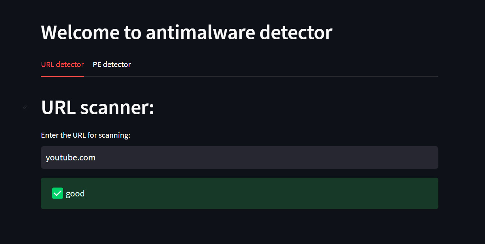
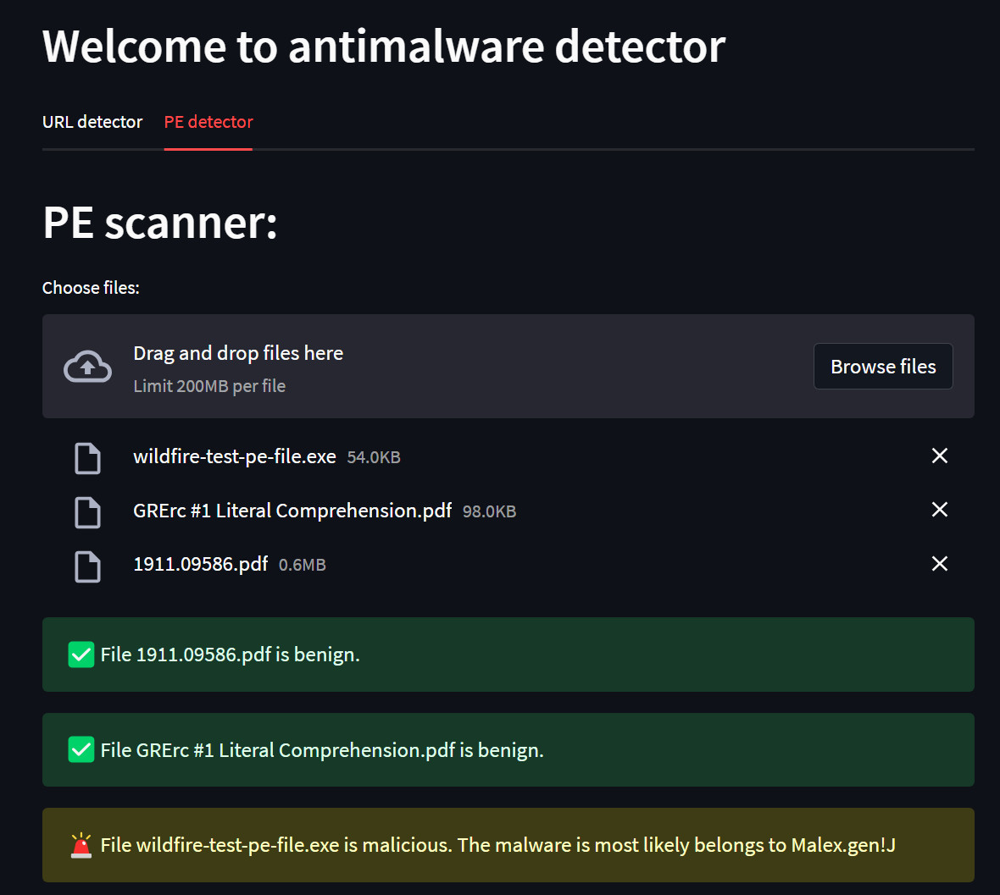

# Technical coding and Solutions

## PE-header-based malware detection

This program applies Random Forest classifier tree to classify a malcious files with benign files based on file's header. The dataset used for training contains 70% malware and 30% benign file, which is described more detail in **ML_model/malware_detection_random_forest.ipynb**

The dataset is slpitted into 70% training data and 30% test data and then we selected the neccessary features required for the classification, the score of model after training is **99.37%**. After training, we use pickle to save the model at **Classifier/PE/pickle_malware_detector.pkl** and list of neccessary features at **Classifier/PE/features.pkl** to keep track of the required function while extracting it.

After the Machine Learning part comes the file extraction part in which we extract the features that are required for the classification. The major challenge that we faced while coding this project was to extract the features of the PE Header file and then storing it for the saved machine learning model. For extracting the content of the PE Header we used pefile library (https://pypi.org/project/pefile/). The selection of those features is done using the feature.pkl model that stores all the important features for the Random Forest Classifier. The extraction of the **PE Header** files is done using pefile library in python and then the selected features are then given to the **Classifier/PE/pickle_malware_detector.pkl** machine and it predicts the output.

---

## Malware classification

This part applies CNN to categorize them into groups and identify their respective families.

In this program, malicious software is visualized as gray scale images since its ability to capture minor changes while retaining the global structure helps to detect variations.

Inspired by the visual resemblance between malware samples from the same family, we suggest a file-agnostic deep learning method for categorizing malware. This method efficiently groups malicious software into families based on distinctive patterns extracted from their visual representation as images.

The model is described in detail at **ML_Model/malware_classification_img_cnn.ipynb**

---

## Malicious URL detection

This part use Logistic Regression to training the machine to identify if give URL is malicious or not.

The model is designed to interpret the data it is trained on and develop a specific behavior based on the data sets. Data sets are crucial to any model, so they must contain accurate and sufficient data for both good and bad URLs for the model to be trained. The first step in using machine learning for malicious website detection is cleaning the data within the data sets. We used the pandas library and created our own vectorizer to clean the data sets, then used logistic regression to train our model.

Since URLs differ from regular text documents, a **sanitization** process is used to extract relevant data from raw URLs. We will create a sanitization function in Python to filter the URLs, providing us with the desired URL data set values for training and testing the model. The data set will have a two-column structure, with one column for URLs and the other for labels indicating whether the URL is malicious or not.

We used the **Tf-idf text feature extraction** approach from the **sklearn** Python module for machine learning. Before that, we had to read the data sets into data frames and matrices that our vectorizer could understand, then pass them to the term-frequency and inverse document frequency text extraction approach. We used the **pandas** Python module for this task. As mentioned earlier, we used the logistic regression method to train our model, but first we passed the data through our custom vectorizer function using the Tf-idf approach, then trained and tested our machine learning model.

Even though the model was not able to accurately predict all good URLs and sometimes grouped good URLs with bad ones, we used a classical method of URL filtering in conjunction with the machine learning model, called **Whitelist Filtering**. This is a list of websites that we know are safe and non-malicious, so we allow these specific websites through our internet traffic. The opposite approach is called blacklisting. This is a simple but effective way to separate our network traffic, and we implemented it in our machine learning model.

---

# How to use

## Install neccessary packages

We use **venv** to set up our virtual enviroment but you also can use other tools like conda to set up your own virtual enviroment. After activate you enviroment, install packages in **requirements.txt**

```
pip install -r requirements.txt
```

## Run program in terminal

Use **main.py** if you want to run the program in ternimal

```
python main.py
```


## Run program with streamlit

Use the following command to run webapp built with streamlit

```
streamlit run app.py
```




